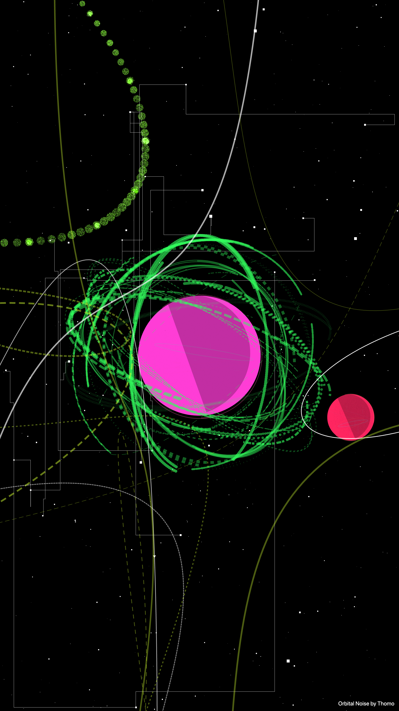
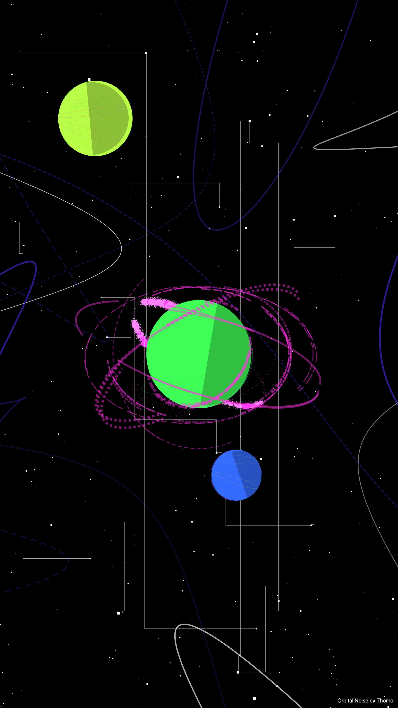
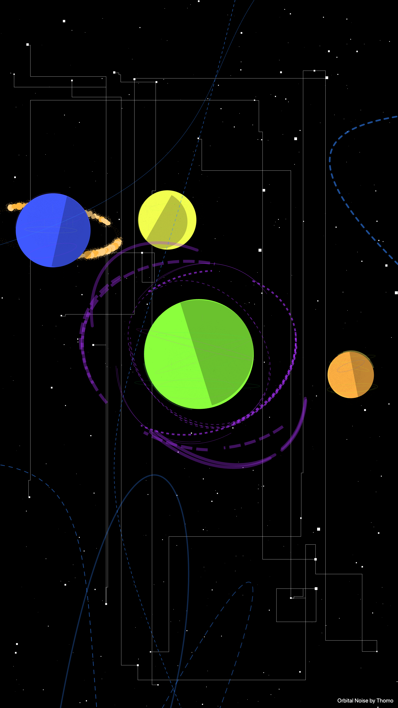
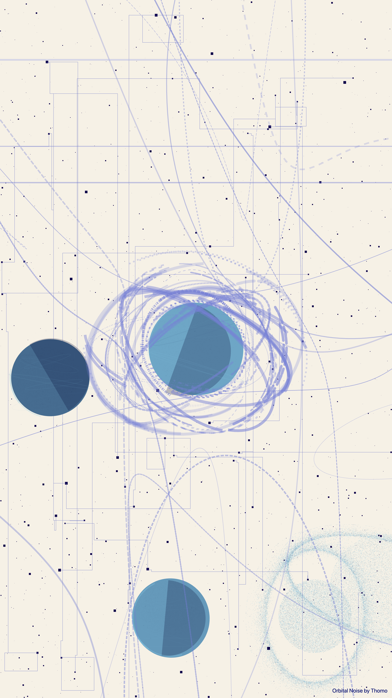
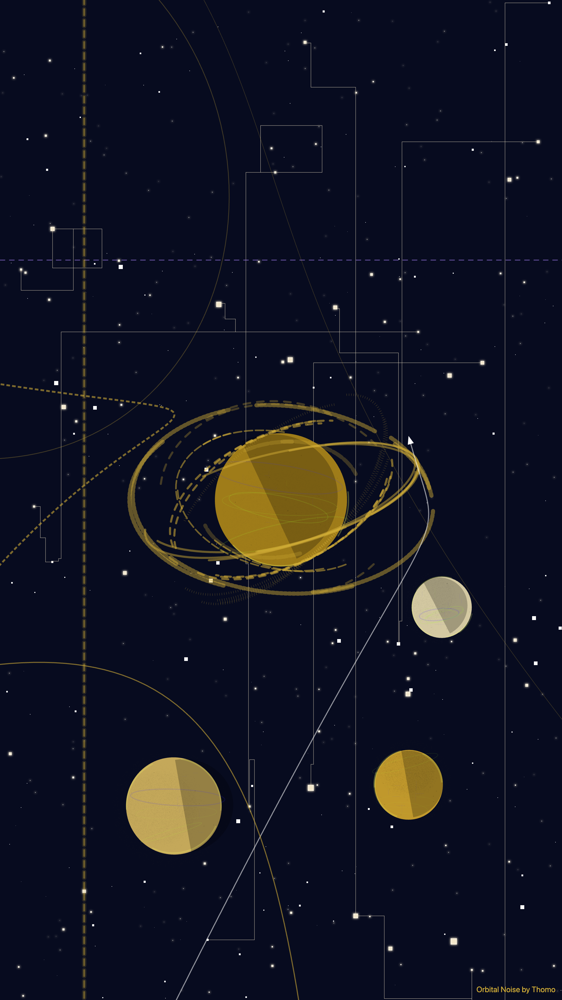
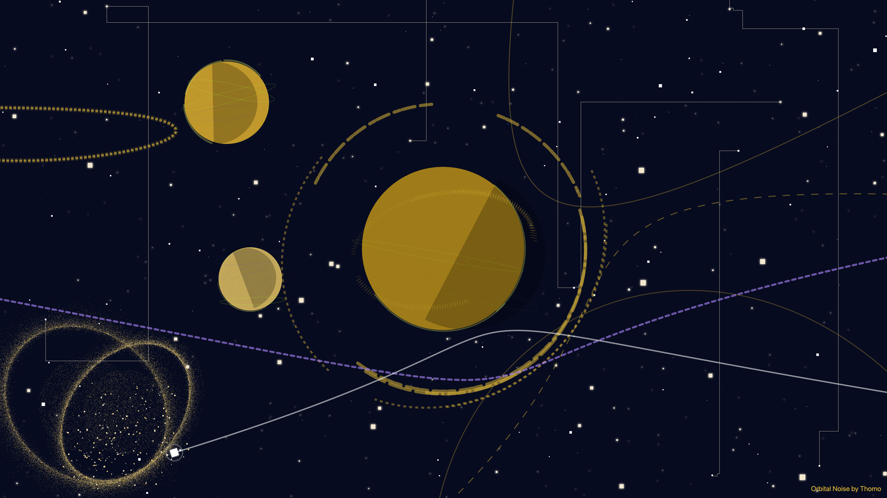
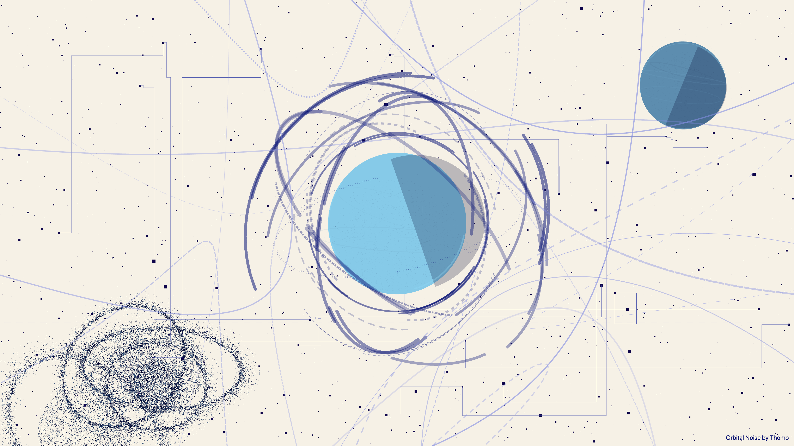
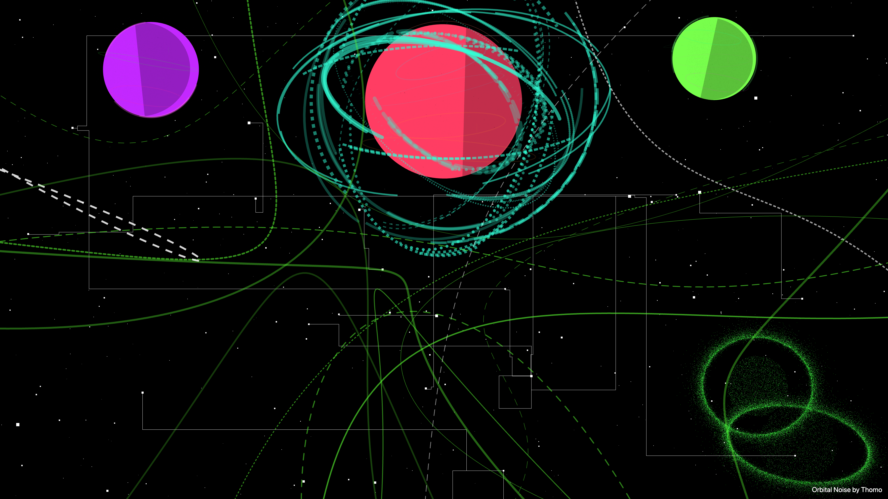

# Orbital Noise

Orbital Noise is a browser-based procedural wallpaper generator that creates cosmos scenes on an HTML canvas.  
It supports multiple visual styles, generates in desktop or mobile formats, and lets you download the result as PNG.

## Features

- Procedural scene generation with seeded randomness
- Three built-in styles:
  - `normal` (neon space palette)
  - `gold` (warm metallic palette)
  - `blue-ink` (ink-style palette)
- Two output formats:
  - Desktop 4K (`3840x2160`)
  - Mobile (`2160x3840`)
- One-click PNG export from the browser UI
- Modular renderer/style architecture for extension

## Screenshots

<p>
  
  
  
</p>
<p>
  
  
</p>
<p>
  
  
  
</p>

## Quick Start

1. Install dependencies:

```bash
npm install
```

2. Start a local static server from the project root:

```bash
python3 -m http.server 5173
```

3. Open [http://localhost:5173](http://localhost:5173) in your browser.
4. Pick a style and format, then click **Generate**.
5. Click **Download PNG** to save the current canvas render.

## Build

Create a production-ready `dist/` folder with minified JavaScript and CSS:

```bash
npm run build
```

## How It Works

- `index.html` defines the app shell and controls.
- `app.js` wires UI events, picks a random seed, and runs generation.
- `config.js` defines style and format options.
- `generatorRegistry.js` lazy-loads style generators.
- `modes/*` expose style-specific generator entry points.
- `src/` contains shared rendering, palette, math, and wallpaper logic.

## Programmatic Usage

You can call a mode directly from JavaScript:

```js
import { generateWallpaper } from "./modes/normal/index.js";

const canvas = document.querySelector("canvas");
const info = generateWallpaper(canvas, {
  width: 3840,
  height: 2160,
  seed: 123456,
  mode: "desktop",
});

console.log(info.seed, info.colors, info.planetCount);
```

Each mode also exports `generateWallpaperAsync` for stepped async rendering.

## Generation Options

Default generation parameters live in:

- `src/wallpaper/defaultOptions.js`

Options are merged and style-scaled by:

- `src/wallpaper/updateOptions.js`
- `src/styles/styleProfiles.js`

## Project Structure

```text
.
|-- app.js
|-- config.js
|-- generatorRegistry.js
|-- index.html
|-- modes/
|   |-- normal/
|   |-- gold/
|   `-- blue-ink/
|-- src/
|   |-- core/
|   |-- render/
|   |-- styles/
|   |-- wallpaper/
|   `-- utils/
`-- styles.css
```

## License

MIT. See [LICENSE](./LICENSE).
